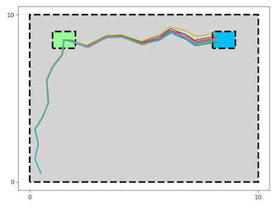
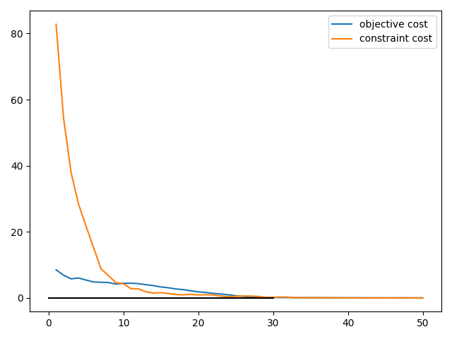

# Constrained CEM MPC

A modified, parallelised implementation of ['Constrained Cross-Entropy Method for Safe Reinforcement Learning', Wen, Topcu.](https://papers.nips.cc/paper/7974-constrained-cross-entropy-method-for-safe-reinforcement-learning)

### Demo environment
- State dimensions = 2
- Action dimensions = 2
- Dynamics func, f(s,a) = s + a
- Trajectories start at (0.5,0.5).
- State constraint: remain within grey rectangle
- Action constraint: remain withiin (-1,1) in both dimensions
- Terminal constraint: end of trajectory must be in blue box
- Objective function: pass through green box

The left image shows trajectories sampled from the distribution after 50 iterations. The right image shows the convergence of the constraint and objective costs over time.

 

Note how the algorithm first solves the constraints, then optimises the objective.